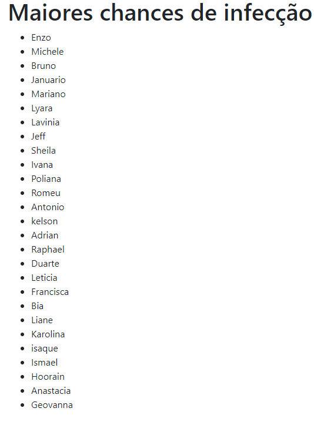

# Corona Risco

**Número da Dupla**: 8 <br>
**Conteúdo da Disciplina**: Grafos 2<br>

## Alunos
|Matrícula | Aluno |
| -- | -- |
| 18/0118005	  |  Carlos Rafael Vasconcelos de Matos |
| 17/0020525  |  Pedro Henrique de Lima Malaquias |

## Sobre 
Mostrar quais pessoas tem mais chances de estarem infectadas pelo vírus, utilizando o algoritmo SCC para achar os grupos fortemente conectados. Abstraindo a ideia, temos o grafo como sendo, por exemplo, uma empresa, onde arestas são pequenos ambientes desta empresa em que U esteve depois de V; sendo u e v, vertices do grafo.

## Mais sobre

As arestas são geradas de forma aleátoria quando o programa entra em funcionamento, cada vez que reiniciar o servidor, são geradas novas arestas e consequentemente novos grupos.

Além disso, enquanto estiver funcionando os grupos permanecem estáticos. Portanto, dado o nome da pessoa infectada, será mostrado todo o grupo SCC, do qual ela pertence. Considerando que as arestas são ambientes em comum, uma pessoa com o virus gera um risco maior ao grupo fortemente conectado a ela.

## Screenshots




## Instalação 

**Linguagem**: JavaScript<br>
**Framework**: Express/Node <br>

Para instalação do projeto, é necessário executar os seguintes comandos:
```
Instalar o Node. (Caso não o tenha)

git clone https://github.com/projeto-de-algoritmos/Corona_risco.git

cd Corona_risco

npm install ou yarn install 
```

## Uso 

```
Na pasta do projeto:

- cd src
- cd logic
- node master.js


Servidor estará rodando...

- Acesse no seu navegador 
http://localhost:3030/

```


## Outros 

Caso não seja possível, rodar o projeto. Será necessário baixar/instalar o node; e colocar no path (variaveis de ambiente do sistema).


